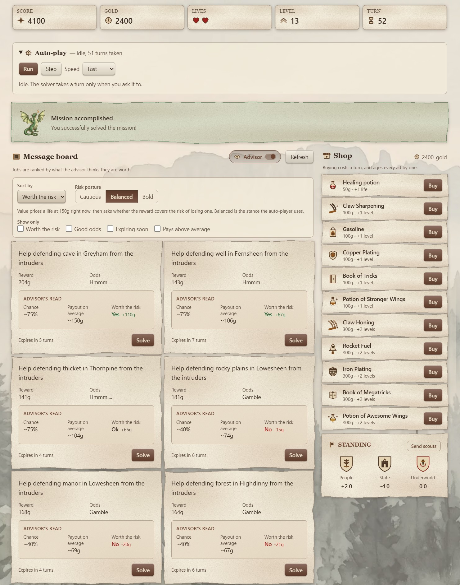
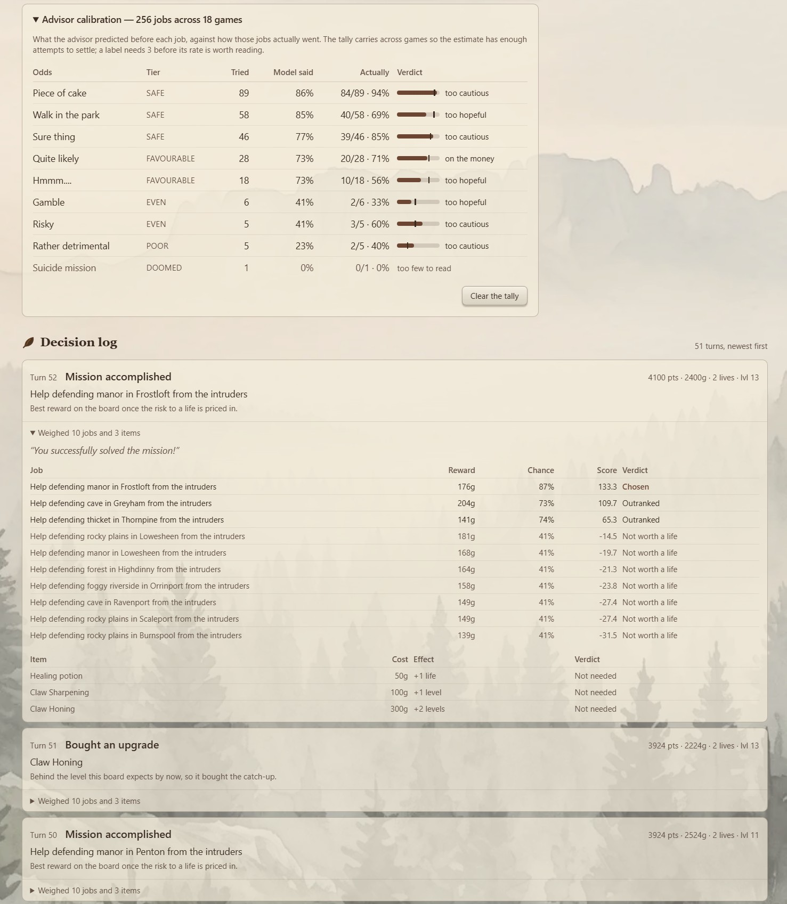

<h1 align="center">
  
</h1>

A playable web app for the [Dragons of Mugloar](https://dragonsofmugloar.com/) adventure, with a
built-in solver that can take the game over and play it out.

The site publishes two adventures — a scripting one and a visual one. This is one product rather
than two: a game you can play by hand, whose **Auto-play** button hands the same board to a solver
that scores every ad, weighs every purchase, and explains each turn it took.

Alongside the board, the UI adds:

- an opt-in **advisor** that rates each ad's chance, average payout and risk-adjusted value;
- three **risk postures**, re-ranking the board by what a life is worth;
- a **trap** flag for the job that pays well and ends runs;
- a **decision log** of the solver's turns, each expandable into the whole board as it ranked it.

## Running it

### With Docker

```bash
docker compose up --build
```

Then open <http://localhost:8081>. Nothing else needs installing — not Java, not Node. Set `PORT`
to publish on a different host port.

### Without Docker

Java 21 and Node 24. Gradle is not required; the wrapper is committed.

```bash
cd api && ./gradlew bootRun
```

```bash
cd web && npm install && npm run dev
```

| | |
|---|---|
| App | <http://localhost:5173> |
| API docs (Swagger UI) | <http://localhost:8081/swagger-ui> |
| Health | <http://localhost:8081/actuator/health> |

The API listens on **8081** (`PORT` overrides it) and the dev server proxies `/api` to it
(`API_URL` overrides the target), so the app is same-origin in development — and in the container,
where Spring serves the built bundle. There is no CORS configuration anywhere in the project.

## Architecture

```
web (Vue 3 + TS + Pinia)  ──►  api (Spring Boot)  ──►  dragonsofmugloar.com/api/v2
```

**The browser never calls the game API directly**, though CORS would allow it. Ad scoring and
message decoding live in one place on the server, so the human player and the solver rank a board
identically instead of drifting apart in two languages, and upstream retries, timeouts and error
mapping get a single home.

What stays in the browser is deliberate, so the UI is not merely a table renderer: live expiry
countdowns, filtering and sorting, what-if re-scoring at three risk postures, optimistic turns
with rollback, and the decision log.

| Path | What it is |
|---|---|
| `api/` | Spring Boot 4.1 on Java 21, Gradle (Kotlin DSL) |
| `web/` | Vue 3 + TypeScript (strict) + Pinia + Tailwind v4, built with Vite |
| `web/e2e/` | Playwright smoke suite, run on three engines |
| `docs/api-findings.md` | Verified upstream behaviour — it contradicts the published API docs in five places |

Backend packages are feature-first: `mugloar` (the only seam to the network), `ads`, `game`,
`shop`, `solver`, `bench`, `web`. Sessions live in an in-memory map with TTL eviction; there is no
database, because nothing here needs to outlive the process.

### The API

| | | Costs a turn |
|---|---|---|
| `POST /api/games` | Start a game | no |
| `GET /api/games/{id}/ads` | The board, scored and decoded | no |
| `GET /api/games/{id}/shop` | The shop | no |
| `POST /api/games/{id}/ads/{adId}/solve` | Take a job | yes |
| `POST /api/games/{id}/shop/{itemId}/buy` | Buy an item — **even if the shop refuses** | yes |
| `POST /api/games/{id}/investigate` | Scout: the only move that cannot cost a life | yes |
| `POST /api/games/{id}/autoplay/step` | Let the solver take one turn | yes |

Turns are the scarce resource, so the server refuses moves that cannot work, the client refuses
them too rather than spending a turn to find out, and **no action that spends a turn is ever
retried** — a request that timed out may already have landed upstream.

Failures leave the API as RFC 9457 `problem+json` carrying an `ErrorCode`, and the UI branches on
that code rather than on a status or a message string. Each code has a severity: `terminal`
replaces the board, `fault` is an alert, `note` is said quietly.

## The solver

Start a game, then use **Auto-play**: `Run` plays until the game ends, `Step` takes a single turn,
and the speed selector paces it — the upstream rate-limits on burst, so the fastest setting is the
one most likely to hit it. Every turn lands in the decision log with the reason behind it and the
whole board as the solver ranked it.

It scores an ad as `reward × p − lifeCost × (1 − p)`, in gold, where `p` is
`P(success | label, reward, level)` and `lifeCost` is a life's value divided by the lives in hand,
so the last life is the dearest. `p` is fitted by maximum likelihood over recorded games rather
than assumed — see `tools/fit-success-model.py`. Levelling is ranked above solving against a
target that grows with the turn count, and when nothing is worth a life and nothing in the shop is
affordable, the solver scouts instead.

The brief asks for "at least 1000 points". Across **46 games played end to end against the live
API at the configuration this repository ships, none finished below 1000** — the lowest was 2700
and the median 4329. To reproduce a distribution yourself:

```bash
cd api && ./gradlew bench -Pgames=34
```

That plays whole games in process — no HTTP layer, no browser — through the same service the
Auto-play button drives, paced so the upstream does not rate-limit.

## Tests

```bash
cd api && ./gradlew test          # JUnit 5 + WireMock, no live API involved
cd web && npm run test:run        # Vitest + Vue Test Utils + MSW
cd web && npm run test:e2e        # Playwright, Chromium + Firefox + WebKit
```

The end-to-end suite runs against the **built** bundle with the backend stubbed inside the page,
so it needs neither Java nor the live game. The stub is a small state machine rather than canned
replies — turns are spent, ads age off the board, lives run out — which lets one spec drive a
whole game to its end. Running it on all three engines is where the cross-browser claim is checked.

Coverage: `./gradlew jacocoTestReport` and `npm run test:coverage`. Reported, never gated. All
three suites run in CI on every push.

## Screenshots

The board mid-game, with the advisor on: every job carries its chance, its average payout and
whether the reward covers the risk to a life, and the shop and standings sit alongside it.



Underneath, the advisor's calibration — what it predicted against how those jobs actually went —
and the decision log, each turn expandable into the whole board as the solver ranked it.


